# Test Drive Vehicle Tracking System - Flowchart

## System Overview

This document outlines the complete workflow for the Test Drive Vehicle Tracking System, showing the interaction between Customers, CRE Dashboard, and Test Drivers.

---

## Main Process Flow

---

## Detailed Component Diagram

---

## Location Sharing Workflow

```mermaid
sequenceDiagram
    participant C as 👤 Customer
    participant CRE as 🖥️ CRE Dashboard
    participant TD as 📱 Test Driver App
    
    C->>CRE: Submits address details
    CRE->>CRE: Converts address to GPS coordinates
    CRE->>CRE: Pinpoints exact location on map
    CRE->>TD: Shares pinpoint location
    TD->>TD: Receives exact GPS coordinates
    TD->>TD: Opens navigation to customer
    
    loop Real-time Tracking
        TD->>CRE: Sends GPS location updates
        CRE->>CRE: Updates driver position on map
    end
    
    TD->>C: Arrives at customer location
```

---

## System Components Summary

| Component | Platform | Key Features |
|-----------|----------|--------------|
| **Customer** | Web/Phone | Provides personal details, address, and car model preference |
| **CRE Dashboard** | Web Application | Views all customer info, pinpoints location, assigns drivers, displays car model |
| **Test Driver App** | Android Mobile | GPS tracking, receives assignments, navigation to exact location |

---

## Data Flow Summary

```mermaid
flowchart TD
    A["🏠 Customer Address<br/>(Door No., Street, Area)"] --> B["📍 Exact GPS Coordinates"]
    B --> C["🖥️ CRE Pins Location<br/>on Dashboard Map"]
    C --> D["📤 Location Shared<br/>with Test Driver"]
    D --> E["📱 Driver App Shows<br/>Pinpoint Location"]
    E --> F["🚗 Driver Navigates<br/>to Customer"]
    F --> G["📡 Real-time GPS<br/>Tracking Active"]
    G -.-> C

    style A fill:#c8e6c9,stroke:#388e3c
    style B fill:#bbdefb,stroke:#1976d2
    style C fill:#b3e5fc,stroke:#0288d1
    style D fill:#ffe0b2,stroke:#f57c00
    style E fill:#ffccbc,stroke:#e64a19
    style F fill:#d1c4e9,stroke:#512da8
    style G fill:#f0f4c3,stroke:#afb42b
```

---

## Key Points

> [!IMPORTANT]
> - **Exact Location**: Customer's precise address is converted to GPS coordinates for accurate pinpointing
> - **Real-time Tracking**: Test driver's location is continuously tracked and visible on CRE dashboard
> - **Car Model Display**: The requested car model is prominently displayed at the bottom of the CRE dashboard
> - **Seamless Assignment**: CRE can assign test drivers with all customer details in one action
